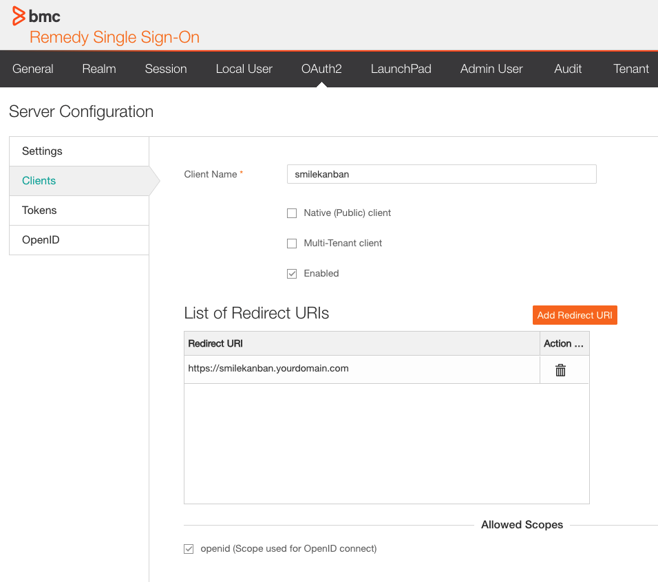

# Deployment

SMILEkanban is best deployed as docker container. Our ready to use image can be found [here](https://hub.docker.com/r/manyos/smilekanban-ui).

# Environment preparation

To avoid [CORS](https://developer.mozilla.org/de/docs/Web/HTTP/CORS) errors you need to allow your local SMILEkanban FQDN in Remedy SSO & Remedy REST API.

## CORS: Remedy SSO (RSSO) & Remedy Rest API

```
ALLOW-FROM https://smilekanban.yourdomain.com
frame-ancestors https://smilekanban.yourdomain.com
Access-Control-Allow-Origin: https://smilekanban.yourdomain.com
Access-Control-Allow-Headers: https://smilekanban.yourdomain.com
```

## OIDC: Remedy SSO

We use Remedy SSO for Authorisation. You need to create a new OAUTH2 client in Remedy SSO.

As redirect URL add your SMILEkanban FQDN.



# Container setup

## Parameters

### REACT_APP_GUI_URL
The FQDN where you deploy SMILEkanban to. Add a trailing slash.

```
REACT_APP_GUI_URL=https://smilekanban.yourdomain.com/
```

### REACT_APP_API_URL
The URL of your [BMC Remedy REST API](https://docs.bmc.com/docs/ars91/en/bmc-remedy-ar-system-rest-api-overview-609071509.html). 

```
REACT_APP_API_URL=https://remedy-api.yourdomain.com
```

### REACT_APP_SSO_URL
The URL of your Remedy SSO Server.

```
REACT_APP_SSO_URL=https://rsso.yourdomain.com/rsso
```

### REACT_APP_TOKEN_REFRESHTIME
Time after your Remedy SSO Access will be refreshed. Make sure it is shorter than your Access Token lifetime.

```
REACT_APP_TOKEN_REFRESHTIME=30
```
### REACT_APP_OIDC_LOGLEVEL
If you encounter problem with OAUTH Authentication set this parameter to 4.

```
REACT_APP_OIDC_LOGLEVEL=4
```
### REACT_APP_CLIENT_ID
The IO of the Remedy SSO OAUTH client you created.

```
REACT_APP_CLIENT_ID=bd6fe29-6c66-4f92-ba44-85b4653993
```
### REACT_APP_CLIENT_SECRET
The secret of the Remedy SSO OAUTH client you created.

```
REACT_APP_CLIENT_SECRET=MIIEvAIBADANBgkqhkiG9w0BAQEFAASCBKYwggSiAgEAAoIBAQCkEWbasYlEesPgCDfrMxJ
```

## Volumes

You need to mount two folders into the container.

* config: A folder where configuration JSON are stored. Mount it to the folder: /usr/share/nginx/html/config
* css: An optional folder for a custom css script. Mount it to the folder: /usr/share/nginx/html/customer

## Sample compose file

``` yaml
services:
  ui: 
    image: manyos/smilekanban-ui
    restart: always 
    environment: 
      - REACT_APP_GUI_URL=https://smilekanban.yourdomain.com/
      - REACT_APP_API_URL=https://remedy-api.yourdomain.com
      - REACT_APP_SSO_URL=https://rsso.yourdomain.com/rsso
      - REACT_APP_TOKEN_REFRESHTIME=30 
      - REACT_APP_OIDC_LOGLEVEL=4
      - REACT_APP_CLIENT_ID=bd6fe29-6c66-4f92-ba44-85b4653993
      - REACT_APP_CLIENT_SECRET=MIIEvAIBADANBgkqhkiG9w0BAQEFAASCBKYwggSiAgEAAoIBAQCkEWbasYlEesPgCDfrMxJ+1aXlMsEeHkKMUFBvnZO4oAfzehNXeQpqur07PQSS2myrKpWvR5JEx74CtXoMaGAyf0783FRx+YMJstOndxO4HVj0N7R1HCy/bdPELCmIU/V0WC9lVxMazBpCq7SWGflDFeukNPb==
    volumes:
      - ./conf:/usr/share/nginx/html/config
      - ./css:/usr/share/nginx/html/customer
```