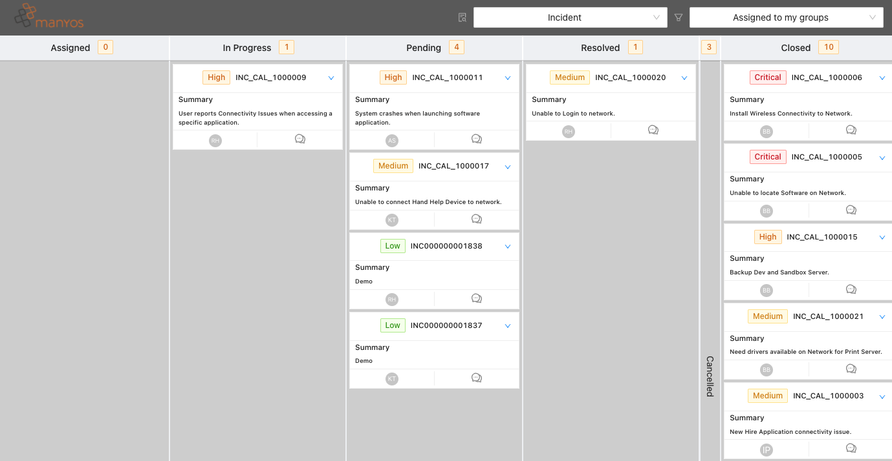

# Free Kanban for BMC ITSM & Custom Applications

Optimize your ITSM flow: work transparent, fast & easy!

Why should you use a kanban board for working with tickets? Most classic ticket tools, like BMC Smart-IT, are using tables for visualizing the tickets in your system. As you can see in the picture below, there's a lack of progress visualization for your tickets.

Further more you can't directly move them to another state, change required fields, and add worklogs, without opening them.

The solution? Kanban Boards. They are the standard tool of agile work - and this for a good reason.

The core concept of Kanban is the optimization of the flow of tasks in your system. Each task should flow through your system with the least amount of drag possible.

Kanban is a workflow management method for defining, managing and improving services that deliver knowledge work. It aims to help you visualize your work, maximize efficiency, and improve continuously. (www.kanbanize.com)

Kanban Boards will help you to visualize your worklist and will give you a good overview about your Work In Progress (WIP). Too many Work In Progress tasks can cause massive multitasking and will reduce the implementation speed of the individual tasks. Visualizing them is the first step to reduce them and to optimize your flow.

By using a Kanban board, you can organize your worklist in simple columns. Change the state of a ticket is just as simple as drag and drop.

This way you will not change your focus all the time, and you can work more efficient and faster.

SMILEkanban is our implementation of Kanban Boards for all BMC Helix ITSM & Custom Build Applications. It offers the following features:

* Fully configurable

* Configure your columns, filters, fields and actions for each type of ticket. You want to make any Remedy Form available as Kanban Board? No Problem -> See the docs for details

* Easy deployable using docker. We provide a ready to use docker image. See the docs for details

* Integrated to Remedy SSO using Oauth2

* This way you can use SMILEkanban without an additional authentication. See the docs for details

* Working on Premise and working on Helix
  SMILEkanban uses BMC Remedy Rest API to communicate with your ITSM Suite. It will work with your on Premise installation as well as with hosted Helix ITSM.

# Free & Open Source

We often use and love open source software. So we want to give back to the community. Our Kanban Boards can be used free of charge and the source code is available on Github.

Contribution is welcome.

Please submit an issue for any problems or feature requests on the [Github Repository](https://github.com/manyosit/smilekanban-ui). If you want to participate, please submit your changes as pull requests.

If you need commercial support or you want us to develop a custom feature for you, please contact us on our [Website](https://manyos.it/en/contact).